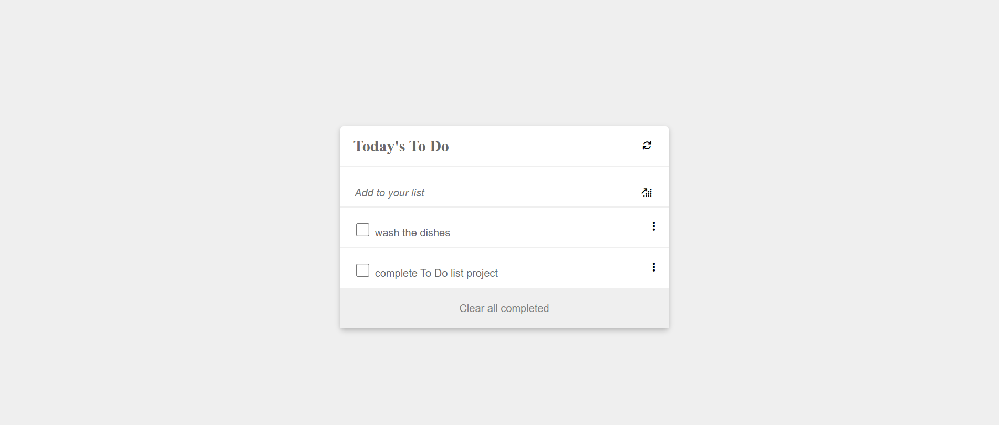

# To-Do-List-Webpack

# Project Name

> Today's To Do List

## Website Link

[Click to see Website](https://theophileaseh.github.io/To-Do-List-Webpack/)

## Screenshot

## Built With

- CSS
- HTML
- Javascript

## Getting Started

To get a local copy up and running follow these simple example steps.

## Authors

👤 **Author1**

- GitHub: [@Theophileash](https://github.com/Theophileaseh)
- Twitter: [@NwachanT](https://twitter.com/NwachanT)
- LinkedIn: [LinkedIn](https://linkedin.com/in/nwachan-theophile-342274172)

## 🤝 Contributing

Contributions, issues, and feature requests are welcome!

Feel free to check the [issues page](../../issues/).

## Show your support

Give a ⭐️ if you like this project!

## Acknowledgments

- Hat tip to anyone whose code was used
- Inspiration
- etc

## 📝 License

This project is [MIT](./MIT.md) licensed.
